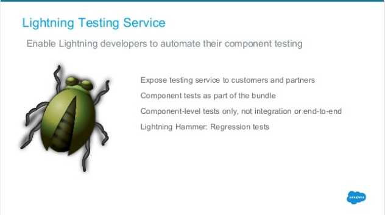

Title: 2016/7/19 の Salesforce
Date: 2016-07-19 10:00
Slug: 2016-07-19
Author: zaki-yama

## イベント・Webinar 情報

### 7/20(水) - 7/21(木) [Salesforce Summer 2016 Tokyo](http://eventjp.salesforce.com/?dis=dev)

今週です。

## ニュース系

### [Amazon、クラウドIDEを提供する「Cloud9」買収。AWSが統合開発環境をSaaSとして提供する布石か － Publickey](http://www.publickey1.jp/blog/16/amazonidecloud9awssaas.html)

Cloud9 というと Salesforce の IDE も提供していたとこですよね。
https://get.c9.io/salesforce/

### [【重要】 Winter '17 でのSalesforce1サポート要件の変更について](https://help.salesforce.com/apex/HTViewSolution?urlname=Winter-17-ios-eos&language=ja)

Winter'17 から S1 のサポート要件が変更となります。
iPhone 5 がサポート対象外になったりするのはまだいいですが、Android に至っては Galaxy や Nexus などの主要なもの以外はすべてサポート対象外になるそうです。
厳しい。。。

### [FAQ - Lightning Experience Navigation Changing with Winter ‘17](https://help.salesforce.com/apex/HTViewSolution?urlname=FAQ-Lightning-Experience-Navigation-Changing-with-Winter-17&language=en_US&eid=ss-tc)

Winter'17 から LEX のメニューが左側でなく上部に移動するようですね。

## 開発者向け

### [Summer '16 Lightning Update for ISVs (June 30, 2016)](http://www.slideshare.net/partnerforce/summer-16-lightning-update-for-isvs-june-30-2016)

前半は Summer'16 のアップデート内容ですが、後半からロードマップが紹介されています。
グローバルナビゲーションについても言及されているほか、気になったのは Lightning Component のテストツールのことが書かれてたことかな。。。

{: width="480px" }

{: width="480px" }

{: width="480px" }

### [Comparing IDEs for Salesforce Development — Arkus, Inc.](http://www.arkusinc.com/archive/2016/comparing-ides-for-salesforce-development)

Salesforce 開発用 IDE の比較。

- Developer Console
- Force.com IDE Plugin for Eclipse
- MavensMate
- Aside.io
- IntelliJ IDEA with Illuminated Cloud
- Cloud9
- Welkin Suite

が紹介されています。けっこう知らないの多い。。。んですが、IDE 使わないので本文はほとんど読んでません。

### [Lightning Components Facets – My Salesforce adventure](https://albasfdc.wordpress.com/2016/05/30/lightning-components-facets/)

Lightning Component の [ファセット](https://developer.salesforce.com/docs/atlas.ja-jp.202.0.lightning.meta/lightning/components_facets.htm) について。
わかりやすいです。

### Trailhead モジュール追加

また色々追加されてるようです。

- [Salesforce 方式でのマネジメント Salesforce Trailhead](https://developer.salesforce.com/trailhead/ja/trail/manage_the_salesforce_way)
- [安全な ID とアクセスの管理 Salesforce Trailhead](https://developer.salesforce.com/trailhead/ja/trail/identity)
- [カスタムメタデータ型 Salesforce Trailhead](https://developer.salesforce.com/trailhead/ja/module/custom_metadata_types)
- [ISV ビジネスプラン Salesforce Trailhead](https://developer.salesforce.com/trailhead/ja/module/isv_business_plan)
